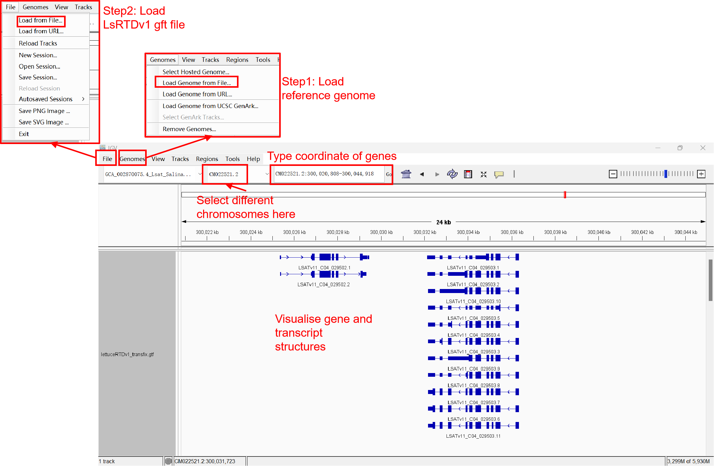

We recommend using IGV (Integrative Genomics Viewer; https://igv.org/) for the visualisation of LsRTDv1. IGV is a powerful and user-friendly tool for visualizing and exploring genomic data. It supports a wide range of data types, including genomic annotations, sequence alignments, and quantitative data tracks. The quick start guide at https://igv.org/doc/desktop/#QuickStart/ provides instructions for downloading, installing, and getting started with using IGV.

To visualize the LsRTDv1 gene models using IGV, you will need to first download the required reference genome sequence and annotation files.

**Step 1: Download the necessary files**

  - Lettuce V11 reference genome sequence: Download the GCA_002870075.4_Lsat_Salinas_v11_genomic.fna file from the NCBI Genbank repository, Genebank version: https://www.ncbi.nlm.nih.gov/datasets/genome/GCF_002870075.4/.
  - LsRTDv1 annotation file: Download the LsRTDv1_transfix.gtf file containing the gene annotations: https://datadryad.org/stash/dataset/doi:10.5061/dryad.xwdbrv1m8

**Step 2: Load the data into IGV**

  - Open the IGV desktop application.
  - Load the Lettuce V11 reference genome sequence by going to "Genomes" > "Load Genome from File" and selecting the GCA_002870075.4_Lsat_Salinas_v11_genomic.fna file.
  - Load the LsRTDv1 annotation file by going to "File" > "Load from File" and selecting the LsRTDv1_transfix.gtf file.

**Step 3: Visualize the LsRTDv1 gene models**

Once the genome and annotation files are loaded, you should be able to see the LsRTDv1 gene models displayed in the IGV genome browser. You can navigate around the genome, zoom in and out, and explore the gene structures and features using the various visualization tools and options available in IGV.

The IGV documentation and tutorials available at https://igv.org/doc/desktop/#QuickStart/ can provide more detailed guidance on how to effectively use IGV for visualizing and exploring genomic data like the LsRTDv1 gene models.

